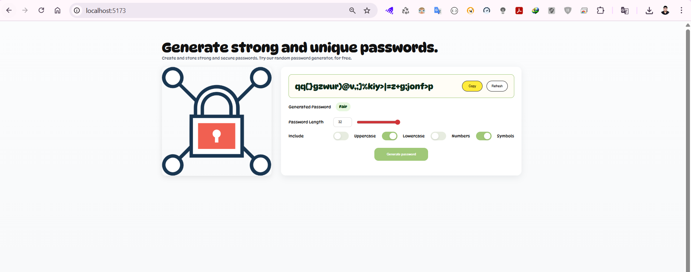

### 🔐 React Password Generator
A modern, responsive password generator built with React, featuring two-way binding, lifted state management, custom fonts, and clean, professional styling (no Tailwind CSS).

This app allows users to generate secure, customizable passwords, adjust password length, and choose between uppercase, lowercase, numeric, and symbolic characters — all while seeing real-time password strength.

📸 Screenshots
### 🏠 Application Overview

🚀 Features

✅ Two-way Binding – Input values (length, toggles) are instantly reflected in the password.
✅ Lifted State – App.jsx manages all main states (length, options, password).
✅ Custom Font – Uses Google Font Poppins for a clean UI.
✅ Responsive Design – Adapts beautifully to all screen sizes.
✅ Copy to Clipboard – Instantly copy generated passwords.
✅ Dynamic Strength Indicator – Displays strength levels: Weak, Fair, or Strong.
✅ Custom Colors –

Accent: #A0C878

Background: #FFFDF6

🧱 Project Structure
src/
│
├── App.jsx                  # Root component with lifted state
├── index.js                 # React entry point
├── index.css                # Global styles (custom font and color theme)
│
├── assets/
│   └── illustration.png      # Left panel image
│
├── utils/
│   └── password.js           # Password generation logic
│
└── components/
    ├── Header.jsx            # Application title and subtitle
    ├── PasswordDisplay.jsx   # Displays generated password + strength
    ├── Controls.jsx          # Length slider and character toggles
    ├── Toggle.jsx            # Toggle switch component
    └── Slider.jsx            # Number + range input combo

⚙️ Installation & Setup
1️⃣ Clone the repository
git clone https://github.com/yourusername/react-password-generator.git
cd react-password-generator

2️⃣ Install dependencies
npm install

3️⃣ Start the development server
npm run dev

🧮 Password Generation Logic

Located in src/utils/password.js, this module handles:

Character pool generation (uppercase, lowercase, numbers, symbols)

Randomized selection

Inclusion of required character types

Shuffling and strength evaluation

generatePassword({
  length: 12,
  includeUpper: true,
  includeLower: true,
  includeNumbers: true,
  includeSymbols: true
});

🎨 Color Palette
Element	Description	Color
Accent	Primary highlights	#A0C878
Background	Light neutral tone	#FFFDF6
Text	Default color	#111
🧠 Technical Highlights

React Functional Components with Hooks (useState, useEffect)

Controlled Inputs for password length and toggles

CSS-only design (no Tailwind or frameworks)

Clipboard API integration for instant password copy

Reusable UI Components – modular design for scalability

🖼️ Adding Your Own Image

Replace src/assets/illustration.png with any image of your choice.
Make sure the image name and path match in:

import illustration from './assets/illustration.png';

📦 Build & Deploy
Build for production:
npm run build

Preview production build:
npm run preview

You can deploy easily to:

Vercel

Netlify

GitHub Pages

🧾 License

This project is licensed under the MIT License.
You are free to use and modify it for personal or commercial purposes.

🙌 Author

Developed by: Shubham Sarkar ©️

💡 Simple. Secure. Beautiful. – A minimal React Password Generator.